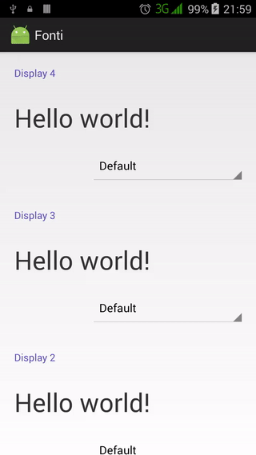

# fonti

Choose a font, please. :smile:

## Introduction :point_up:

This repo has code that was made to improve the features of the [graphiscaler repo](https://github.com/joshua-kairu/graphiscaler).

## Version History :package:

**latest**&nbsp;&nbsp;&nbsp;[Fonti v1.0.0](https://github.com/joshua-kairu/fonti/releases/download/v1.0.0/fonti-v1.0.0.apk)&nbsp;&nbsp;&nbsp;Thursday, May 26, 2016 
This repo tries its best to follow the [Semantic Versioning](http://semver.org/) guidelines.

## How To Use :wrench:

:zero: Fire up ze app. 

:one: You'll a scrollable list of items in the default Android font, as well as a pulldown menu.

:two: Choose one of the four available fonts so as to change the appearance of the associated text.

Here is a video of the app in action.

 

## Abilities :muscle:

This app can:
* to select a font from the collection of the default font, Courgette Regular, Noto Sans Bold, and Oxygen Mono Regular.

## Limitations :worried:

Unlike graphiscaler, fonti cannot:
* display Android type. Can't set style in code. :disappointed:

## Possible Future Work :fast_forward:

As of Thursday, June 2, 2016, some of the things that can be done in the future with this app are: 
- [ ] Allow font change in code.
- [ ] Use other kinds of fonts.

## Other things :books:

Thanks to:
* Udacity for the base material for this app.

## License :lock_with_ink_pen:

This repository is licensed under the [GNU General Public License Version 3](http://www.gnu.org/licenses/gpl-3.0.en.html).
